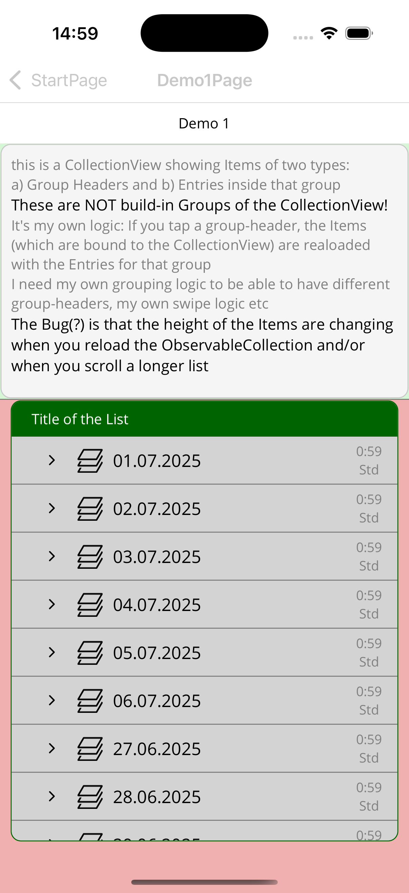
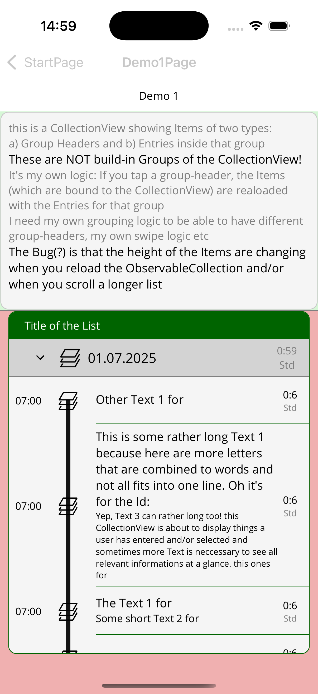
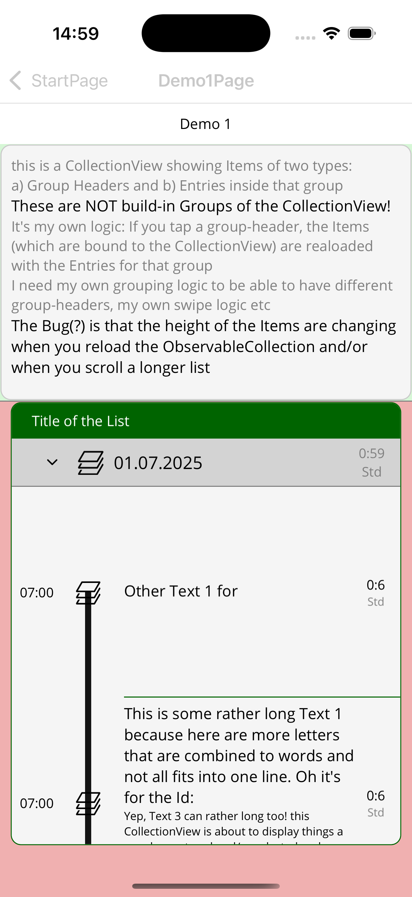

# CollectionViewIssues
Maui .net9 Demo to show UI Problems with CollectionView

Start the App and click the first Demo:

From here: Tap one of the Headers to see it's children entries

Now scroll the list and you will see the problem (height of lines are changing / not fitting the content or are getting REALLY big)

If you can't see it, just click on another header to open more children - often the items are changing their sizes then.

These are NOT CollectionView-Groups! This is FLAT CollectionView with just a simple ObservableCollection. 
The Items are all of the IMyData Type.
A TemplateSelector is choosing to display either a Group-Layout or an Entry-Layout.
when you tap a "Group", the ObservableCollection is reloaded with the entries of the group included. 

this works very well with Xamarin.Forms on iOS and Android:
- Scroll Position was preserved
- After such a "reload" i was able to "CollectionView.ScrollTo(my-first-item-in-the-opened-group, MakeVisible)" - this kinda works here with Maui .net9 but not reliable - i think because the height of the items are computed wrong anyway (SrollTo not in this demo yet)

This Problem was there with Maui .net8 too

My only workaround so far (not in this demo yet):
- create a new DataTemplate-Instance FOR EVERY ITEM!!

this works but is SLOW(!) and sure needs more memory
